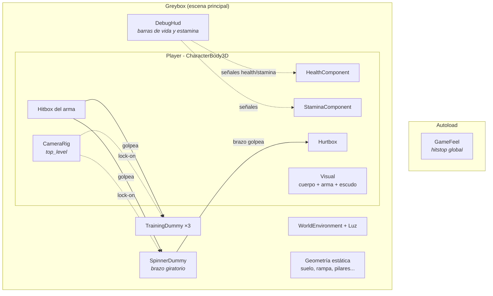
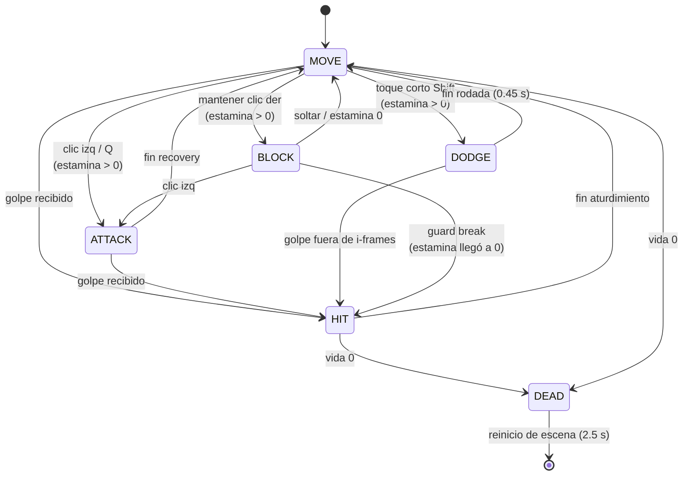
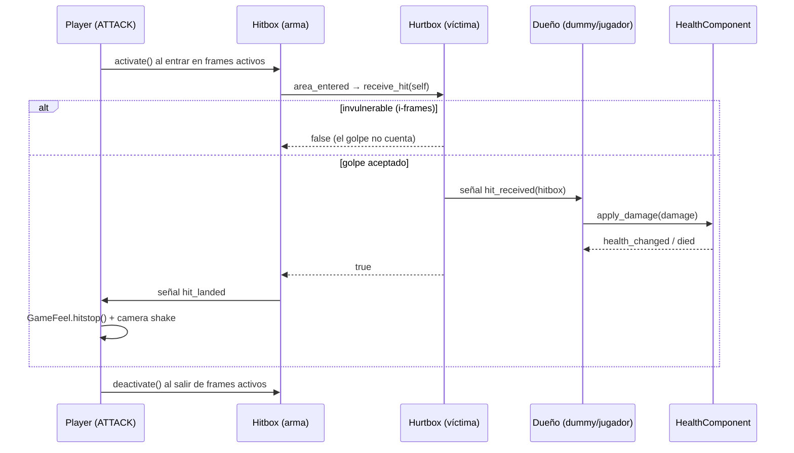
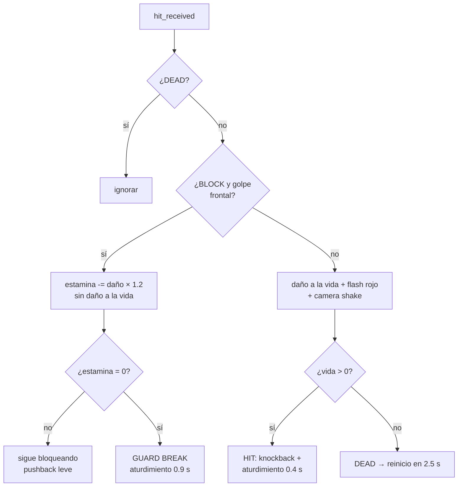

# Arquitectura del código

Documentación técnica del estado actual (Fases 1–2: movimiento, cámara y combate núcleo).
Los diagramas son [Mermaid](https://mermaid.js.org) — GitHub y Obsidian los renderizan.

## Visión general



Principios:

- **Componentes reutilizables** (`scripts/components/`): vida, estamina, hitbox y hurtbox
  son nodos genéricos que se montan igual en el jugador, los maniquís y los futuros
  enemigos de la Fase 3.
- **Las señales desacoplan**: el HUD no conoce al jugador (lo busca por grupo `player`
  y escucha señales); la hurtbox no aplica daño (avisa al dueño y él decide, porque
  puede estar bloqueando).
- **Todo parámetro de game feel es `@export`**: se ajusta desde el inspector sin tocar código.

## Estructura de carpetas

```text
scenes/
  levels/greybox.tscn      Escena principal de pruebas
  player/player.tscn       Jugador completo (cámara incluida)
  enemies/*.tscn           Maniquís de entrenamiento
  ui/debug_hud.tscn        HUD provisional
scripts/
  player/player.gd         Máquina de estados del jugador
  player/camera_rig.gd     Cámara orbital + lock-on + shake
  components/*.gd          Vida, estamina, hitbox, hurtbox
  enemies/*.gd             Lógica de maniquís
  autoload/game_feel.gd    Hitstop (singleton GameFeel)
  ui/debug_hud.gd          HUD provisional
```

## Máquina de estados del jugador

`player.gd` implementa una FSM por enum. Un solo estado activo; `_state_time` mide
el tiempo dentro del estado y gobierna las ventanas de ataque, i-frames y aturdimiento.



Notas:

- **Sprint vs esquiva** comparten botón (estilo souls): mantener Shift/B esprinta,
  un toque corto (≤ 0.2 s) ejecuta la rodada.
- En `BLOCK`, un golpe frontal **no** cambia de estado (solo gasta estamina), salvo
  que la deje en 0 → guard break con aturdimiento largo (0.9 s vs 0.4 s normal).
- `DEAD` recarga la escena a los 2.5 s.

## Ataques: ventanas de tiempo

Cada ataque tiene tres fases; el hitbox del arma **solo daña durante los frames activos**.

| Ataque | Windup | Activo | Recovery | Daño | Estamina |
| --- | --- | --- | --- | --- | --- |
| Ligero (tajo horizontal) | 0.25 s | 0.20 s | 0.30 s | 15 | 20 |
| Fuerte (golpe descendente) | 0.45 s | 0.25 s | 0.45 s | 32 | 35 |

La animación placeholder es un tween sobre `WeaponPivot` sincronizado con esas
mismas duraciones; cuando lleguen animaciones reales (Fase 5+), las ventanas se
moverán a ellas sin tocar la lógica.

## Flujo de un golpe



Reglas del `Hitbox`:

- Ignora la hurtbox de su propio `source` (nadie se golpea a sí mismo).
- Un golpe por activación y objetivo, salvo `rehit_interval > 0`
  (el brazo giratorio usa 0.8 s para poder regolpear).

## Decisión al recibir daño (jugador)



## Estamina (reglas souls)

- La acción **sale si queda estamina > 0**, aunque no cubra el coste: se descuenta
  hasta 0 (el "último esfuerzo").
- Regeneración a 30/s tras **0.8 s sin gastar**; bloqueando regenera al 35%.
- El sprint drena 12/s de forma continua y se corta al llegar a 0.
- Costes: esquiva 25, bloqueo = daño del golpe × 1.2.

## Capas de física

| # | Nombre | Bit | Quién vive ahí |
| --- | --- | --- | --- |
| 1 | mundo | 1 | Geometría estática |
| 2 | jugador | 2 | Cuerpo del Player |
| 3 | enemigos | 4 | Cuerpos de maniquís/enemigos |
| 4 | combate | 8 | Hurtboxes (los hitboxes solo escanean, layer 0) |

| Objeto | Layer | Mask | Por qué |
| --- | --- | --- | --- |
| Player (cuerpo) | 2 | 1+4=5 | Choca con mundo y enemigos |
| Maniquí (cuerpo) | 4 | — | Bloquea al jugador y al lock-on |
| SpringArm (cámara) | — | 1 | Solo el mundo tapa la cámara, los cuerpos no |
| LockOnArea | — | 4 | Detecta enemigos fijables (grupo `lock_target`) |
| Hurtbox | 8 | — | Recibe |
| Hitbox | — | 8 | Golpea |

## Cámara y lock-on

- `CameraRig` es `top_level`: sigue la **posición** del jugador con suavizado pero
  no hereda su rotación; el cuerpo (`Visual`) rota aparte.
- Suavizados con `1 - exp(-k·delta)` para ser independientes del framerate.
- **Selección de objetivo**: entre los cuerpos del grupo `lock_target` dentro del
  área (12 m), gana el de **menor ángulo respecto al centro de la cámara**.
  La rueda del ratón salta al siguiente por ángulo con signo (izquierda/derecha).
- El lock se rompe: a más de 14 m, si el objetivo muere (sale del grupo) o al
  pulsar lock-on de nuevo.
- **Shake por trauma**: los golpes suman trauma (0.25–0.5); la sacudida es
  `trauma² × magnitud` sobre `h_offset/v_offset` de la cámara y decae sola.

## Grupos y señales clave

| Grupo | Uso |
| --- | --- |
| `player` | El HUD localiza al jugador sin acoplarse a la escena |
| `lock_target` | Candidatos al lock-on; salir del grupo = morir a efectos de juego |

| Señal | Emisor | Escuchas típicas |
| --- | --- | --- |
| `health_changed`, `died` | HealthComponent | HUD, dueño (animación de muerte) |
| `stamina_changed` | StaminaComponent | HUD |
| `hit_received(hitbox)` | Hurtbox | Dueño (aplica daño/bloqueo) |
| `hit_landed(hurtbox)` | Hitbox | Atacante (hitstop + shake) |
