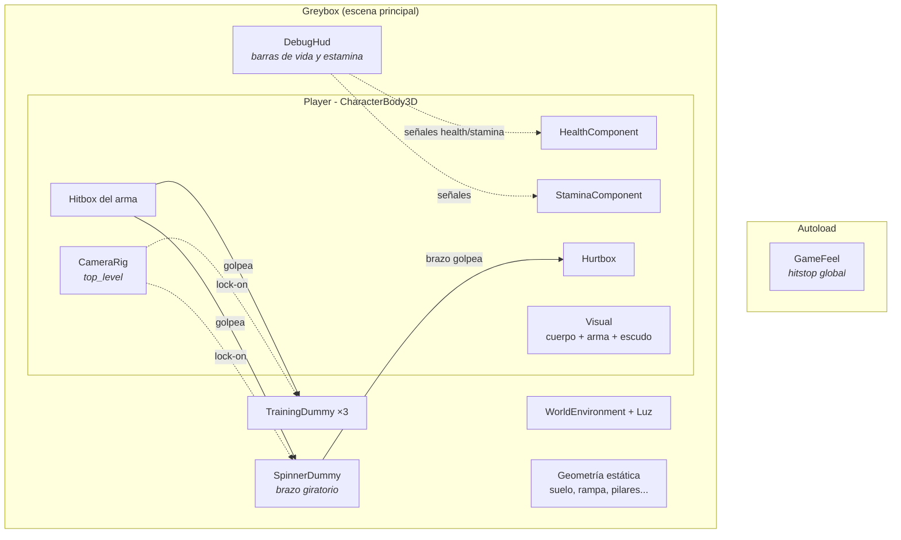
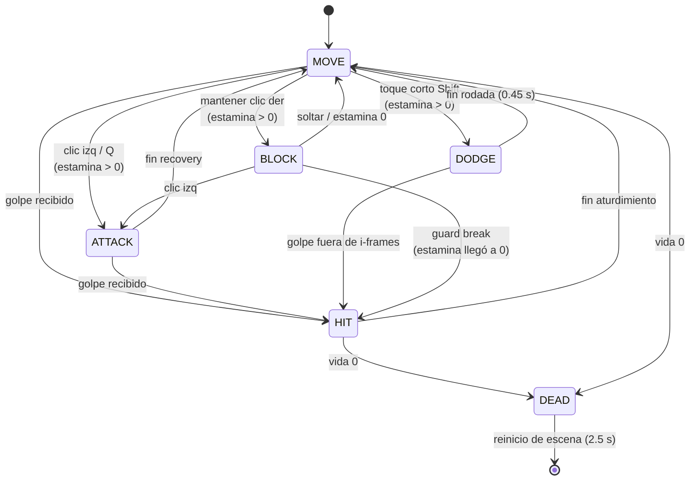
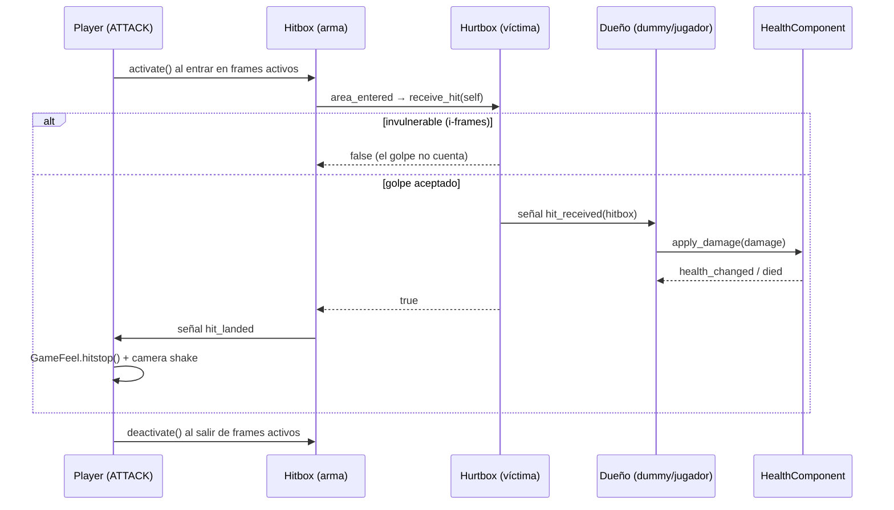
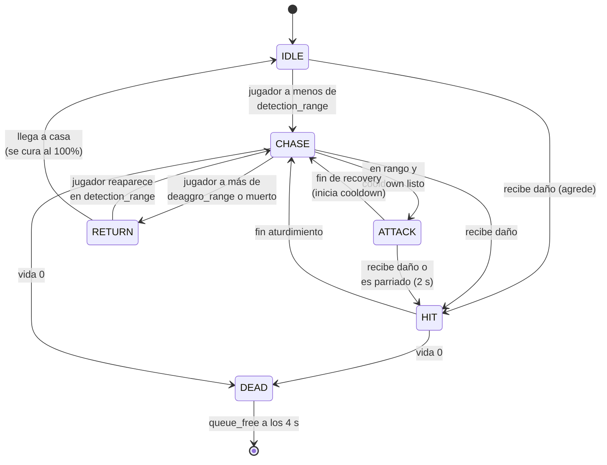
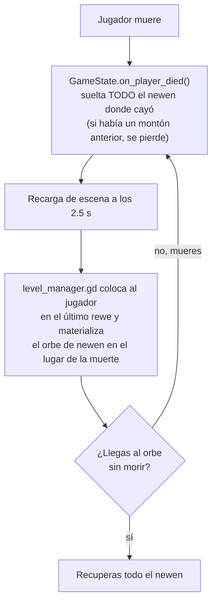
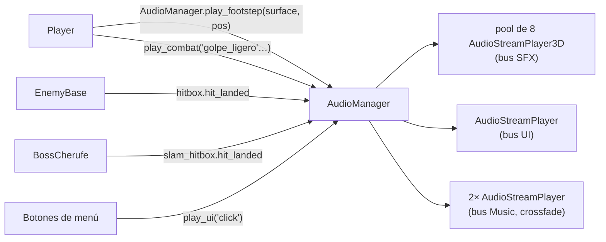

# Arquitectura del código

Documentación técnica del estado actual (Fases 1–7: movimiento, cámara, combate,
enemigos con IA, sistemas soulslike, jefe y UI/UX). Los diagramas son
[Mermaid](https://mermaid.js.org) — GitHub y Obsidian los renderizan.

## Visión general



Principios:

- **Componentes reutilizables** (`scripts/components/`): vida, estamina, hitbox y hurtbox
  son nodos genéricos que se montan igual en el jugador, los maniquís y los futuros
  enemigos de la Fase 3.
- **Las señales desacoplan**: el HUD no conoce al jugador (lo busca por grupo `player`
  y escucha señales); la hurtbox no aplica daño (avisa al dueño y él decide, porque
  puede estar bloqueando).
- **Todo parámetro de game feel es `@export`**: se ajusta desde el inspector sin tocar código.

## Estructura de carpetas

```text
scenes/
  levels/greybox.tscn      Escena principal de pruebas
  player/player.tscn       Jugador completo (cámara incluida)
  enemies/*.tscn           Maniquís de entrenamiento
  ui/debug_hud.tscn        HUD provisional
scripts/
  player/player.gd         Máquina de estados del jugador
  player/camera_rig.gd     Cámara orbital + lock-on + shake
  components/*.gd          Vida, estamina, hitbox, hurtbox
  enemies/*.gd             Lógica de maniquís
  autoload/game_feel.gd    Hitstop (singleton GameFeel)
  ui/debug_hud.gd          HUD provisional
```

## Máquina de estados del jugador

`player.gd` implementa una FSM por enum. Un solo estado activo; `_state_time` mide
el tiempo dentro del estado y gobierna las ventanas de ataque, i-frames y aturdimiento.



Notas:

- **Sprint vs esquiva** comparten botón (estilo souls): mantener Shift/B esprinta,
  un toque corto (≤ 0.2 s) ejecuta la rodada.
- En `BLOCK`, un golpe frontal **no** cambia de estado (solo gasta estamina), salvo
  que la deje en 0 → guard break con aturdimiento largo (0.9 s vs 0.4 s normal).
- **Parry**: los primeros **0.18 s** tras levantar el escudo son ventana de parry —
  un golpe recibido ahí no hace daño ni gasta estamina, produce hitstop largo y
  llama a `on_parried()` del atacante, que queda aturdido ~2 s (ventana de castigo).
- `DEAD` recarga la escena a los 2.5 s.

## Ataques: ventanas de tiempo

Cada ataque tiene tres fases; el hitbox del arma **solo daña durante los frames activos**.

| Ataque | Windup | Activo | Recovery | Daño | Estamina |
| --- | --- | --- | --- | --- | --- |
| Ligero (tajo horizontal) | 0.25 s | 0.20 s | 0.30 s | 15 | 20 |
| Ligero 2 — combo (tajo de vuelta, en espejo) | 0.16 s | 0.18 s | 0.35 s | 17 | 15 |
| Fuerte (golpe descendente) | 0.45 s | 0.25 s | 0.45 s | 32 | 35 |

La animación placeholder es un tween sobre `WeaponPivot` sincronizado con esas
mismas duraciones; cuando lleguen animaciones reales (Fase 5+), las ventanas se
moverán a ellas sin tocar la lógica.

### Buffer de inputs y cancelaciones (Fase 9)

- **Buffer** (`BUFFER_WINDOW = 0.3 s`): durante un ataque, la siguiente
  acción pulsada (ligero, fuerte o el tap de esquiva) se guarda y se
  ejecuta en el primer frame legal — sin esto los inputs entre animaciones
  se pierden y el combate se siente "sordo". El buffer se limpia al recibir
  un golpe (un stagger no debe "recordar" órdenes previas).
- **Combo ligero**: con "ligero" en buffer durante el recovery de un tajo
  ligero, el segundo golpe (`light2`) sale de inmediato — más rápido, algo
  más de daño, menos estamina, animación en espejo. No encadena un tercero:
  tras `light2` el buffer se resuelve al terminar el recovery completo
  (permite el ritmo tajo-tajo-pausa-tajo).
- **Esquiva cancela recovery**: el tap de esquiva en buffer corta el
  recovery de cualquier ataque en cuanto terminan los frames activos —
  la agresión tiene salida defensiva inmediata, como en los souls.

## Flujo de un golpe



Reglas del `Hitbox`:

- Ignora la hurtbox de su propio `source` (nadie se golpea a sí mismo).
- Un golpe por activación y objetivo, salvo `rehit_interval > 0`
  (el brazo giratorio usa 0.8 s para poder regolpear).

## Decisión al recibir daño (jugador)

```mermaid
flowchart TD
    A[hit_received] --> B{¿DEAD?}
    B -- sí --> Z[ignorar]
    B -- no --> C{¿BLOCK y golpe<br/>frontal?}
    C -- sí --> P{¿dentro de la ventana<br/>de parry (0.18 s)?}
    P -- sí --> PR["PARRY ⚡<br/>sin daño ni estamina<br/>atacante aturdido 2 s"]
    P -- no --> D["estamina -= daño × 1.2<br/>sin daño a la vida"]
    D --> E{¿estamina = 0?}
    E -- no --> F[sigue bloqueando<br/>pushback leve]
    E -- sí --> G[GUARD BREAK<br/>aturdimiento 0.9 s]
    C -- no --> H[daño a la vida + flash rojo<br/>+ camera shake]
    H --> I{¿vida > 0?}
    I -- sí --> J[HIT: knockback +<br/>aturdimiento 0.4 s]
    I -- no --> K[DEAD → reinicio en 2.5 s]
```

## Estamina (reglas souls)

- La acción **sale si queda estamina > 0**, aunque no cubra el coste: se descuenta
  hasta 0 (el "último esfuerzo").
- Regeneración a 30/s tras **0.8 s sin gastar**; bloqueando regenera al 35%.
- El sprint drena 12/s de forma continua y se corta al llegar a 0.
- Costes: esquiva 25, bloqueo = daño del golpe × 1.2.

## Capas de física

| # | Nombre | Bit | Quién vive ahí |
| --- | --- | --- | --- |
| 1 | mundo | 1 | Geometría estática |
| 2 | jugador | 2 | Cuerpo del Player |
| 3 | enemigos | 4 | Cuerpos de maniquís/enemigos |
| 4 | combate | 8 | Hurtboxes (los hitboxes solo escanean, layer 0) |

| Objeto | Layer | Mask | Por qué |
| --- | --- | --- | --- |
| Player (cuerpo) | 2 | 1+4=5 | Choca con mundo y enemigos |
| Maniquí (cuerpo) | 4 | — | Bloquea al jugador y al lock-on |
| SpringArm (cámara) | — | 1 | Solo el mundo tapa la cámara, los cuerpos no |
| LockOnArea | — | 4 | Detecta enemigos fijables (grupo `lock_target`) |
| Hurtbox | 8 | — | Recibe |
| Hitbox | — | 8 | Golpea |

## IA de enemigos (Fase 3)

`enemy_base.gd` (`EnemyBase`) implementa la FSM común; las variantes se crean
**solo con exports** (color, vida, velocidades, tiempos de ataque) al instanciar
la escena — no hay un script por variante, salvo la de a distancia que
sobreescribe dos métodos para disparar proyectiles.



Reglas clave:

- **Telegrafiado**: al iniciar ataque, destello amarillo + el arma se alza durante
  todo el windup. Durante el windup el enemigo sigue apuntando al jugador; la
  dirección queda fijada al soltar el golpe (esquivable).
- **Recibir daño siempre agrede**, aunque el jugador esté fuera del rango de visión.
- **Volver a casa cura al 100%** (regla souls: no se puede desgastar a un enemigo
  a base de huir).
- **Parry**: `on_parried()` interrumpe el ataque y aturde `parry_stagger` (2 s).
- **Sin fuego amigo**: los hitboxes de enemigos usan `ignore_group = "enemies"`.

### Variantes actuales (configuradas en el greybox)

| Variante | Color | Vida | Velocidad | Daño | Windup | Rasgo |
| --- | --- | --- | --- | --- | --- | --- |
| Pesado | Rojo oscuro | 150 | 2.6 | 24 | 0.8 s | Lento, pega como camión |
| Rápido | Verde azulado | 50 | 5.5 | 9 | 0.3 s | Frágil, apenas telegrafía |
| A distancia | Púrpura | 60 | 3.5 | 12 | 0.7 s | Dispara a 9 m, retrocede si te acercas a 4 m |

### Navegación

- El greybox cuelga su geometría de un `NavigationRegion3D` cuyo navmesh se
  **hornea en runtime** (`navmesh_baker.gd` llama a `bake_navigation_mesh()` en
  `_ready`), parseando los colisionadores estáticos hijos. Editar el nivel no
  requiere rehornear a mano.
- Cada enemigo lleva un `NavigationAgent3D`: en CHASE/RETURN fija
  `target_position` y avanza hacia `get_next_path_position()`.
- Los enemigos no colisionan entre sí (mask = mundo + jugador) para evitar
  atascos en pasillos.

### Proyectiles

`projectile.tscn`: nodo con un `Hitbox` (mask = hurtboxes + mundo). Vuela recto,
se destruye al impactar cualquier cosa o a los 4 s. El enemigo a distancia lo
instancia en `_attack_became_active()` apuntando al pecho del jugador — se
esquiva con la rodada (i-frames) o moviéndose lateralmente.

## Sistemas soulslike (Fase 4)

El autoload **`GameState`** guarda todo lo que debe sobrevivir a las recargas de
escena (muerte y descanso): newen, nivel, estadísticas, frascos, punto de
reaparición y el newen soltado. Se persiste en `user://savegame.json` al
descansar y al morir.

### El bucle de muerte



### El rewe (checkpoint)

Al pulsar **E** dentro del área del rewe:

1. Fija el punto de reaparición y **guarda la partida**.
2. Rellena los frascos de lawen.
3. Abre el **menú de nivel** (el juego se pausa): repartir newen entre estadísticas.
4. Al levantarse, **el mundo se recarga**: enemigos reaparecen y todo se cura
   (regla souls: descansar tiene un precio).

### Estadísticas

| Estadística | Efecto por punto |
| --- | --- |
| Vigor | +8 vida máxima |
| Resistencia | +5 estamina máxima |
| Fuerza | +4% daño del ataque fuerte |
| Destreza | +4% daño del ataque ligero |
| Espiritualidad | Reservada para el trance del kultrún (GDD) |

- Base 10 en todo → 100 de vida y 100 de estamina iniciales.
- Subir de nivel cuesta `80 + 20 × nivel` newen (crece cada nivel).
- Los enemigos otorgan newen al morir (`newen_reward`: 20–60 según variante).

### Frascos de lawen

**R** cura el 40% de la vida máxima si queda algún frasco (3 al inicio).
Solo se rellenan descansando en el rewe.

## El jefe: Cherufe (Fase 6)

Diseño completo, tabla de ataques y diagrama de estados en
[jefe-cherufe.md](jefe-cherufe.md). Resumen de la arquitectura:

- **No hereda de `EnemyBase`**: la FSM del jefe (`boss_cherufe.gd`) es propia
  porque su comportamiento diverge bastante (sin estado RETURN/casa, dos fases,
  tres ataques en vez de uno) — reutiliza los mismos componentes
  (HealthComponent, Hurtbox, Hitbox, NavigationAgent3D) pero no la lógica de FSM.
- **Activación diferida**: nace `DORMANT` (hurtbox inactiva) hasta que
  `boss_trigger.gd` —el `Area3D` en el que se convirtió la niebla— llama a
  `awaken(player)`. Antes de eso es completamente inofensivo e invulnerable.
- **Persistencia de jefes**: `GameState.defeated_bosses` (paralelo a
  `shortcuts`) recuerda para siempre qué jefes están muertos; el jefe
  se autodestruye en `_ready()` si ya figura como vencido, incluso tras
  recargar la escena al descansar en el rewe.
- **Peligro de erupción** (`eruption_hazard.tscn`, solo Fase 2): anillo de
  aviso que crece durante el telegrafiado y detona con un `Hitbox` — mismo
  patrón hitbox/hurtbox que el resto del combate, sin caso especial.
- **Barra de vida de jefe**: `boss_health_bar.tscn` permanece oculta hasta
  que `boss_trigger.gd` llama a `track(boss, nombre)`, que conecta sus propias
  señales (`health_changed`, `died`, `phase_changed`) — el mismo patrón
  desacoplado que usa el HUD del jugador.
- **Modelo 3D propio (v2)**: `Visual/Body` instancia
  `assets/models/cherufe/cherufe_base.glb` — un golem generado por script de
  Blender (`bpy`), no un asset de terceros. `boss_cherufe.gd` busca el
  `MeshInstance3D` en `$Visual/Body/CherufeBody` (el nombre que el importador
  de glTF le da al único mesh de la escena importada) en vez de `$Visual/Body`
  directamente, porque `Body` ahora es la raíz `Node3D` de la escena
  instanciada. El cuerpo es un torso/cabeza orgánico por metaballs con
  extremidades fusionadas por Boolean (Union), rugosidad real por
  Subdivision+Displace (ruido Voronoi) y color por vértice procedural
  (roca oscura con vetas de lava en las grietas más profundas); los ojos y
  la boca goteando lava son mallas emisivas separadas, unidas al cuerpo en
  el mismo objeto final (no viven sueltas en la escena de Godot como en la
  v1). Detalle de diseño e investigación mitológica en
  [jefe-cherufe.md](jefe-cherufe.md).

  > [!warning] Gotcha de Godot: `size=1` vs `size=2` en `primitive_cube_add`
  > Al generar la malla por script, `bpy.ops.mesh.primitive_cube_add(size=1)`
  > crea un cubo de semi-tamaño 0.5 — escalarlo por `(sx, sy, sz)` da un
  > semi-extento real de `0.5*scale`, no `scale`. La primera pasada del
  > script asumía que `scale` ya era el semi-extento, así que el torso
  > terminó siendo la mitad de ancho de lo previsto y los brazos (colocados
  > asumiendo el ancho correcto) quedaron flotando lejos del cuerpo. Fix:
  > usar `size=2` (vértices en ±1) para que `scale` sea directamente el
  > semi-extento deseado, igual que `radius` en cilindros/conos.

  > [!warning] Gotcha de Blender: `Boolean` deja un slot de material vacío
  > Al fusionar el core con las extremidades vía modificador `Boolean`
  > (`operation='UNION'`), Blender inserta un slot de material **vacío**
  > (`None`) en el índice 0 si el objeto activo aún no tenía materiales — y
  > ahí se quedan todas las caras (`material_index` por defecto es 0). Si
  > después simplemente haces `mesh.materials.append(mat)`, el material real
  > cae en el slot 1 **sin que ninguna cara lo use**: el cuerpo se renderiza
  > con el material vacío (gris) aunque el color por vértice esté perfecto.
  > Pasó desapercibido al principio porque una luz cálida de relleno en el
  > render de verificación *simulaba* variación de color por iluminación.
  > Fix: `mesh.materials.clear()` antes de `append()`, para que el material
  > real quede garantizado en el slot 0 real.
  >
  > Por separado, el exportador de glTF de Blender a veces **también**
  > pierde la asignación de material (`material: null` en el glTF) cuando el
  > Base Color viene de un nodo de color por vértice — reproducido con el
  > Cherufe (mesh de 3 materiales) pero no con el weichafe (mesh de 1 solo
  > material), así que parece ligado a mallas multi-material. El atributo
  > `COLOR_0` se exporta igual, y aunque el material sí llegue bien, Godot
  > **no** activa `vertex_color_use_as_albedo` automáticamente al importar
  > — hay que asumir en ambos casos que el material embebido no sirve tal
  > cual y hacer override explícito en el `.tscn`
  > (`surface_material_override/0` con `vertex_color_use_as_albedo = true`).
  > Para overridear la superficie de un nodo *dentro* de una escena
  > instanciada, la sintaxis es `[node name="X" parent="Ruta/Al/Padre"
  > index="N"]` (sin `type=` ni `instance=`) seguida de las propiedades.

- **Modelo 3D del jugador (weichafe)**: mismo enfoque que el Cherufe
  (`assets/models/weichafe/weichafe_base.glb`, fuente en
  `assets/models/weichafe/blender_source/`) pero con proporciones humanas
  ágiles y sin armadura pesada (GDD: "joven weichafe... la defensa es
  esquivar, no resistir"). Torso/cadera/cabeza por metaballs, brazos y
  piernas normales (sin garras), color por vértice por zona de altura en
  vez de ruido de grieta (piel en cabeza/manos/pies, textil rojo-tierra en
  el torso, calzas oscuras en las piernas). A propósito **no** modela
  rasgos faciales ni étnicos específicos por script — el GDD pide
  explícitamente evitar estereotipos, y una cara "realista" generada por
  primitivas resultaría en el mejor de los casos genérica y en el peor,
  caricaturesca; se dejó la cabeza simple y estilizada, coherente con el
  arte low-poly del proyecto, para que cualquier detalle facial se decida
  a mano en Blender. `Visual/Body` en `player.tscn` instancia el modelo;
  `player.gd` referencia `$Visual/Body/WeichafeBody`.

## Cámara y lock-on

- `CameraRig` es `top_level`: sigue la **posición** del jugador con suavizado pero
  no hereda su rotación; el cuerpo (`Visual`) rota aparte.
- Suavizados con `1 - exp(-k·delta)` para ser independientes del framerate.
- **Selección de objetivo**: entre los cuerpos del grupo `lock_target` dentro del
  área (12 m), gana el de **menor ángulo respecto al centro de la cámara**.
  La rueda del ratón salta al siguiente por ángulo con signo (izquierda/derecha).
- El lock se rompe: a más de 14 m, si el objetivo muere (sale del grupo) o al
  pulsar lock-on de nuevo.
- **Shake por trauma**: los golpes suman trauma (0.25–0.5); la sacudida es
  `trauma² × magnitud` sobre `h_offset/v_offset` de la cámara y decae sola.

## UI/UX (Fase 7)

Menú principal, pausa, opciones e inventario — con exclusión mutua para que
nunca se abran dos superposiciones a la vez.

```mermaid
flowchart TD
    MM["MainMenu<br/>(escena principal)"] -->|Nueva Partida| RESET["GameState.reset_new_game()"] --> BOSQUE[bosque.tscn]
    MM -->|Continuar| BOSQUE
    MM -->|Opciones| OPT[OptionsMenu]

    BOSQUE -->|tecla Pause| PM[PauseMenu]
    BOSQUE -->|tecla Inventory| IM[InventoryMenu]
    PM -->|Opciones| OPT
    PM -->|Guardar y salir| MM
    REWE[Rewe] -->|E: descansar| RM[ReweMenu]

    PM -. UiState.try_open/close .-> UI[(UiState<br/>menu_open)]
    IM -. UiState.try_open/close .-> UI
    REWE -. UiState.try_open/close .-> UI
```

- **`UiState`** (autoload): un único booleano `menu_open` compartido por
  Pausa, Inventario y el menú del Rewe. `try_open()` falla si ya hay otro
  menú abierto — así nunca se apilan ni pelean por el modo del ratón.
  Solo el menú "raíz" que abrió (Pausa/Inventario/Rewe) pausa el árbol y
  cambia el modo del ratón; `OptionsMenu`, anidado dentro de Pausa o del
  menú principal, no toca `UiState` — simplemente se muestra u oculta.
- **`Settings`** (autoload, separado de `GameState`): volumen maestro,
  sensibilidad de cámara y remapeo de teclado, persistidos en
  `user://settings.cfg` (`ConfigFile`, no JSON) — es configuración del
  usuario, no progreso de partida, por eso sobrevive a "Nueva Partida".
  El remapeo edita `InputMap` en runtime (solo el evento de teclado de
  cada acción; el mando y los clics de ratón quedan intactos).
- **`PauseMenu` e `InventoryMenu`** son autoloads-escena con
  `process_mode = PROCESS_MODE_ALWAYS`: siguen escuchando su tecla incluso
  con el árbol pausado o antes de que exista ninguna partida. Cada uno
  ignora el otro mientras esté visible gracias a `get_viewport().set_input_as_handled()`
  tras actuar, evitando una condición de carrera donde cerrar uno reabriera
  el otro en el mismo frame.

> [!warning] Gotcha de Godot: `Control` vacío + `mouse_filter` por defecto
> `MainMenu` y `PauseMenu` tienen un `OptionsContainer` — un `Control` vacío
> a pantalla completa donde se instancia `OptionsMenu` solo cuando se abre.
> Como es el **último** hijo (se dibuja encima de todo) y el `mouse_filter`
> por defecto de un `Control` es **Stop**, absorbía cualquier clic del ratón
> aunque no tuviera hijos ni contenido visible — el menú se veía perfecto
> pero ningún botón respondía. En `PauseMenu` (autoload siempre presente)
> esto bloqueaba el ratón en **todo el juego**, no solo en el menú.
> **Fix**: `mouse_filter = 2` (`MOUSE_FILTER_IGNORE`) en el contenedor vacío
> — dejar pasar el clic mientras no tenga contenido interactivo propio.
> Lección: cualquier `Control` de pantalla completa que exista "por si acaso"
> (contenedores de overlays dinámicos, áreas de drop, etc.) necesita revisar
> su `mouse_filter` explícitamente si no está pensado para capturar input.

- **Grupo `"level"`**: los menús de pausa/inventario solo reaccionan si
  `get_tree().current_scene` pertenece a este grupo — así no interfieren
  con el menú principal, que no lo tiene.
- **`MainMenu`**: "Nueva Partida" llama a `GameState.reset_new_game()`
  (limpia newen, stats, atajos, jefes vencidos…) antes de cargar el nivel;
  "Continuar" solo se habilita si `GameState.has_respawn` es verdadero, y
  carga `GameState.respawn_scene` (el nivel donde estaba el último rewe).

## Audio (Fase 8)



- **`AudioManager`** (autoload): único punto de entrada para sonido.
  `play_footstep(surface, pos)` y `play_combat(name, pos)` reproducen en un
  *pool* rotatorio de 8 `AudioStreamPlayer3D` (posicional, bus `"SFX"`) con
  variación aleatoria de pitch (0.94–1.06) para que no suenen repetitivos;
  `play_ui(name)` usa un `AudioStreamPlayer` 2D (bus `"UI"`); `play_music()`
  hace crossfade entre dos `AudioStreamPlayer` (bus `"Music"`) — preparado
  pero **sin pistas todavía** (ver pendientes de Fase 8 en el plan).
- **Buses** (`default_bus_layout.tres`): `Master → SFX / Music / UI`. Los
  tres sub-buses envían a `Master`, así el slider general los escala a
  todos; `Settings` añade `sfx_volume` y `music_volume` independientes
  (persisten en `user://settings.cfg` junto al volumen general).
- **Pasos por superficie**: `Player._current_surface()` lanza un raycast
  corto hacia abajo (capa `"mundo"`) y busca en el colisionador los grupos
  `"surface_piedra"` / `"surface_madera"`; si no encuentra ninguno, cae en
  `"pasto"` (el suelo del bosque hoy es un único `StaticBody3D` sin
  etiquetar — el sistema ya soporta variarlo por zona con solo añadir el
  grupo al `StaticBody3D` correspondiente, p. ej. el piso de la ruca).
- **Impactos de combate**: cada `Hitbox` que debe sonar conecta su señal
  `hit_landed` a `AudioManager.play_combat(...)` — el jugador al golpear
  (`golpe_ligero`/`golpe_fuerte` según el ataque), `EnemyBase` y el slam
  del Cherufe (`jefe_impacto`). El parry y el bloqueo se disparan aparte
  (`_execute_parry` / rama de bloqueo en `_on_hit_received`) porque no
  dependen de que la hurtbox reciba daño.

## Renderizado (Fase 9)

El nivel principal (`bosque.tscn`) usa el stack moderno de Forward+:

- **SDFGI** (iluminación global dinámica por SDF, 4 cascadas, media
  resolución vía project setting): los árboles y la ruca rebotan luz de
  verdad; las grietas de lava de la arena iluminan el entorno sin luces
  puntuales extra.
- **Niebla volumétrica** con dispersión de la luz direccional
  (`light_volumetric_fog_energy = 1.4`): rayos de sol de atardecer entre
  los pinos ("god rays") — la niebla exponencial clásica queda de respaldo
  a baja densidad para el horizonte lejano.
- **Glow/bloom** con umbral HDR: solo lo emisivo (lava, ojos del Cherufe,
  vetas, marcador de lock-on) florece; el resto de la imagen no se lava.
- **Tonemapping AgX** (`tonemap_mode = 4`) + ajustes leves de
  contraste/saturación: el estándar filmico actual, aguanta los naranjas
  intensos de la lava sin quemarse a blanco.
- **TAA** global + **sombras suaves** (filtro alto, atlas direccional de
  4096, `light_angular_distance` para penumbra física del sol) +
  anisotrópico ×4 — en `project.godot`, aplican a todas las escenas.
- **SSAO** (radio 2.0) para contacto de oclusión en la base de árboles,
  rocas y props.

Todo está en el `Environment` de la escena o en `project.godot` — no hay
código de renderizado; el greybox de pruebas mantiene el entorno simple.

## Game feel: partículas (Fase 9)

- **`Fx`** (autoload, paralelo a `AudioManager`): único punto de entrada
  para partículas. `burst(preset, posición)` dispara un one-shot de un pool
  de 12 `GPUParticles3D`; los presets (`chispas`, `chispas_parry`, `polvo`,
  `muerte`, `lava`, `curacion`) se construyen **por código** en `_ready()`
  (`ParticleProcessMaterial` + `QuadMesh` billboard con color ramp que se
  desvanece) — sin un `.tscn` por efecto, y los recursos se comparten entre
  usos del mismo preset.
- **Trail del arma**: `Fx.create_trail(hitbox)` crea un emisor persistente
  colgado del hitbox del arma con `local_coords = false` (las partículas
  quedan en el mundo, dibujando el arco del tajo). El jugador lo enciende
  exactamente en los frames activos del ataque y lo apaga al terminar,
  al entrar en stagger o al morir — mismos puntos donde se desactiva el
  hitbox, para que nunca quede emitiendo colgado.
- **Brasas del rewe**: `Fx.create_embers(nodo)` — emisor en bucle, lento y
  ascendente con `preprocess = 2.0` para que ya haya brasas visibles al
  cargar la escena (sin "arranque en frío").
- Dónde suena cada burst: golpe conectado (`chispas`), parry
  (`chispas_parry` en el escudo), esquiva (`polvo` a ras de suelo), muerte
  de enemigo y recogida de newen (`muerte`, verde), impactos/fase 2/muerte
  del Cherufe y detonación de la erupción (`lava`), frasco de lawen
  (`curacion`).

## Grupos y señales clave

| Grupo | Uso |
| --- | --- |
| `player` | El HUD y los enemigos localizan al jugador sin acoplarse a la escena |
| `lock_target` | Candidatos al lock-on; salir del grupo = morir a efectos de juego |
| `enemies` | Fuego amigo: los hitboxes enemigos ignoran hurtboxes de este grupo |

| Señal | Emisor | Escuchas típicas |
| --- | --- | --- |
| `health_changed`, `died` | HealthComponent | HUD, dueño (animación de muerte) |
| `stamina_changed` | StaminaComponent | HUD |
| `hit_received(hitbox)` | Hurtbox | Dueño (aplica daño/bloqueo) |
| `hit_landed(hurtbox)` | Hitbox | Atacante (hitstop + shake) |
