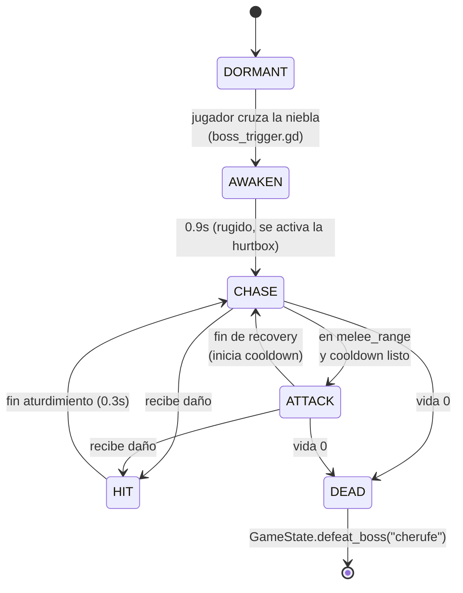

# Jefe 1 — El Cherufe

Diseño del primer jefe (Fase 6). Escena: `scenes/bosses/boss_cherufe.tscn`.
Guion: [[GDD - Documento de Diseño]] — ser de roca y magma que habita los volcanes,
exigía sacrificios humanos en el mito original.

## Máquina de estados

- **DORMANT**: invisible a efectos de combate (hurtbox `monitorable = false`);
  espera a que el disparador de niebla llame a `awaken(player)`.
- **Sin estado RETURN**: a diferencia de los enemigos comunes, el Cherufe no
  tiene "casa" — una vez despierto, persigue hasta morir. La arena está
  amurallada, así que no hay a dónde huir.
- **Transición de fase** (dentro de `_on_hit_received`): al primer golpe que
  deja la vida ≤ 50%, pasa a Fase 2 de forma permanente (no puede revertir).

## Ataques

| Ataque | Fase | Alcance | Windup | Activo | Recovery | Daño | Notas |
| --- | --- | --- | --- | --- | --- | --- | --- |
| **Golpe de roca** (slam) | 1 y 2 | cuerpo a cuerpo (≤3.2 m) | 0.9 s | 0.35 s | 0.8 s | 34 | Embiste hacia delante al golpear |
| **Lanzamiento de roca** (throw) | 1 y 2 | distancia | 0.8 s | — | 0.7 s | 20 | Reutiliza `projectile.tscn` a ×2.2 de escala |
| **Erupción** (AoE) | **solo Fase 2** | bajo el jugador | 1.2 s (telegrafiado) | instantáneo | — | 28 | Anillo de aviso naranja que crece; detona donde estaba el jugador al invocarse — esquivable moviéndose |

- **Selección de ataque**: si la distancia al jugador es ≤ `melee_range` → slam;
  si no → throw. En Fase 2, cada `eruption_every` (3) ataques normales se
  intercala una erupción en su lugar, obligando a no quedarse quieto.
- **Fase 2** también sube la velocidad de persecución (×1.35) y reduce el
  cooldown entre ataques (×0.7) — el jefe se siente genuinamente más peligroso,
  no solo con más vida.

## Arena y flujo de entrada

- La **niebla** (`FogGate`, ahora un `Area3D` con `boss_trigger.gd`) ya no
  bloquea el paso: al cruzarla, despierta al jefe, conecta la barra de vida
  y se desvanece para siempre (no vuelve a activarse en esa partida).
- Suelo con grietas de lava emisivas como primer pase de arte de la arena.
- **Sin sello de niebla** (a diferencia de otros souls): el jugador puede
  retirarse de la pelea si lo necesita. Se documenta como simplificación
  consciente de este vertical slice; un sello real (con `gate.gd`) es
  candidato de pulido en la Fase 9.

## Recompensa y persistencia

- Al morir: **300 de newen** y `GameState.defeat_boss("cherufe")` — el jefe
  no vuelve a aparecer nunca más en esa partida (ni siquiera al descansar en
  el rewe, que recarga la escena y respawnea al resto de enemigos).
- La niebla, si el jefe ya está vencido, aparece desvanecida desde el `_ready()`
  del propio disparador — no hace falta re-cruzar la arena para notarlo.

## UI

- `scenes/ui/boss_health_bar.tscn`: oculta hasta que `track(boss, nombre)` es
  llamado por el disparador; muestra nombre, barra roja y una etiqueta de
  fase que aparece solo al entrar en Fase 2. Se desvanece 1s después de la muerte.

## Modelo 3D

`assets/models/cherufe/cherufe_base.glb` — golem humanoide low-poly (piernas,
**v2 (2026-07-16)** — reemplazado el greybox de bloques por un modelo más
orgánico y fiel a la mitología. Investigué descripciones del Cherufe antes de
modelar: "cuerpo una amalgama cambiante de magma y roca", "llamas bailando en
sus ojos", "roca fundida escurriendo de su boca abierta", extremidades largas
con garras (fuentes: [Wikipedia](https://en.wikipedia.org/wiki/Cherufe),
[Mythbeasts](https://mythbeasts.com/beast/cherufe/),
[Mitologicus](https://mitologicus.com/mapuche/cherufe/)). El script de
Blender (`bpy`) construye:

- **Torso/cabeza/hombros orgánicos** vía metaballs (masas asimétricas que se
  funden solas, sin las caras planas del bloque v1) — postura encorvada,
  hocico/mandíbula alargados hacia delante.
- **Extremidades largas con garras**: brazos que cuelgan casi hasta la
  rodilla terminados en 4 garras por mano; piernas digitígradas con 3 garras
  por pie. Fusionadas al torso con modificador **Boolean (Union, solver
  Exact)** — sin costuras visibles.
- **Rugosidad de roca real** (no solo textura): Subdivision Surface + Displace
  con textura de ruido Voronoi, aplicados antes de exportar — el detalle está
  en la geometría, no en un mapa de normales.
- **Color por vértice** procedural: roca oscura con vetas más claras según
  ruido 3D; los vértices en las "grietas" más profundas se tiñen hacia el
  color de lava — sin necesidad de desenvolver UVs ni pintar a mano.
- **Ojos brillantes** y **boca goteando lava** (blob emisivo + 2 gotas bajo
  la mandíbula) — referencia directa a la mitología.
- **Espinas dorsales asimétricas** para reforzar la silueta de "amalgama
  irregular".

~3.2 m de alto, calza con la cápsula de colisión existente. Fuente editable:
`assets/models/cherufe/blender_source/cherufe_base.blend` (`.gdignore` para
que Godot no la escanee — es un `.blend` normal, se abre igual que cualquier
otro proyecto de Blender). Modelo 100% propio (sin licencia de terceros).

> [!warning] Gotcha de Godot: el exportador de glTF de Blender "pierde" el
> material del cuerpo cuando el Base Color viene de un nodo de color por
> vértice (el atributo `COLOR_0` sí se exporta, el material no). Solución:
> override explícito en `boss_cherufe.tscn` (`surface_material_override/0`
> con `vertex_color_use_as_albedo = true`) en vez de depender del material
> embebido en el `.glb`.

> [!note] Techo de "foto-realismo"
> Salto grande en detalle sobre el v1, pero no es foto-realista — eso
> requiere esculpido y pintura de texturas a mano en Blender, que un script
> no puede hacer solo. Es un punto de partida más rico para seguir
> esculpiendo a mano.

## Pendiente / fuera de alcance de la demo

- [ ] Playtest de dificultad y ritmo del combate
- [x] Modelo 3D del Cherufe (v2, más orgánico y fiel al mito) ✅ 2026-07-16 — falta esculpido/pintura a mano para foto-realismo real
- [ ] Sello real de niebla (impedir retirada)
- [ ] Música de jefe (Fase 8)
- [ ] Cinemática de entrada / cámara dedicada
