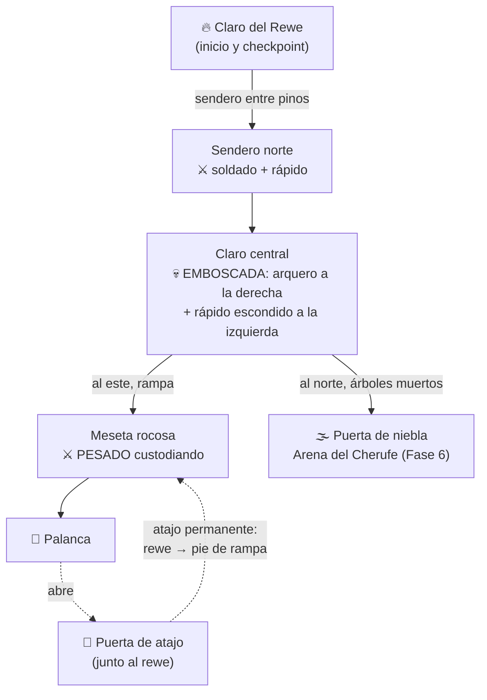

# Nivel 1 — Bosque de Araucarias

Diseño del vertical slice (Fase 5). Escena: `scenes/levels/bosque.tscn`.

## Estructura (bucle soulslike clásico)

## El recorrido pensado

1. **Claro del rewe**: descansar es lo primero que aprende el jugador (prompt visible).
2. **Sendero**: dos enemigos sueltos presentan el combate en espacio estrecho.
3. **Claro central**: la emboscada castiga correr sin mirar — el arquero púrpura
   dispara desde la derecha mientras un rápido salta desde los arbustos.
4. **Rampa a la meseta**: el pesado (150 HP, golpe de 24) custodia la palanca.
   Es el "muro" del nivel: si el jugador va muy justo, aprende a volver al rewe.
5. **La palanca abre la puerta** junto al rewe: el atajo clásico — de vuelta,
   el camino rewe → meseta toma 15 segundos en vez de todo el bosque.
6. **Zona norte**: árboles muertos anuncian la corrupción; la puerta de niebla
   naranja (impasable) marca la arena del jefe de la Fase 6.

## Métricas

| Cosa | Valor |
| --- | --- |
| Tamaño del mapa | 80×80 m |
| Enemigos | 5 (1 soldado, 2 rápidos, 1 arquero, 1 pesado) |
| Newen total disponible | 150 por vuelta (25+20+20+35+60) — subir de nivel cuesta 100 |
| Checkpoint | 1 rewe (inicio) |
| Atajos | 1 (palanca en meseta → puerta junto al rewe, persistente) |

## Arte (primer pase)

- Modelos **CC0 de Quaternius** (Ultimate Stylized Nature, vía mirror MIT):
  pinos como araucarias jóvenes, árboles muertos, rocas, arbustos y hierba.
  Ver [CREDITS.md](../CREDITS.md).
- Ambientación: atardecer con niebla (`fog_density 0.012`), luz cálida baja,
  cielo oscuro — el tono "oscuro místico" del GDD.
- Los árboles no tienen colisión todavía (decisión de greybox: no bloquear
  el combate mientras se ajustan posiciones).

## Pendiente para cerrar la fase

- [ ] Playtest de ritmo: ¿el recorrido completo toma 10–15 min la primera vez?
- [ ] Colisión en árboles que bordean el camino principal
- [ ] Arena del jefe real detrás de la niebla (Fase 6)
- [ ] Assets temáticos propios: **pendiente descarga manual** de Sketchfab (chemamüll ×2,
  rehue, kultrün — todos CC-BY del FabLab UC Temuco). Ver la tabla y los pasos en
  [CREDITS.md](../CREDITS.md). Requiere cuenta gratuita de Sketchfab; no automatizable.
- [x] 2 props CC-BY descargados directo (escudo de madera, hacha) en `assets/models/props_cc/` ✅ 2026-07-13
